# TL;DR

- jwt 기반 사용자 인증 로직의 동작을 설계하고 구현합니다.
- Guard 파이프라인을 활용하여 인증 및 권한 로직을 구현합니다.
- `bcrypt`를 활용하여 jwt 토큰 로직을 구현합니다.
- SMTP를 활용하여 이메일 인증을 구현합니다.

# 배경

## 관련 개념

### bcrypt

- 정의 : 패스워드 해싱 알고리즘
- 특징

  - 다른 해쉬 알고리즘보다 암호화 속도가 매우느립니다.
  - 암호화 속도를 설정 할 수 있습니다.
  - salt를 사용합니다.
  - 다양한 언어에서 구현되어 있습니다.
  - blowfish 기반으로 동작합니다.
  - 72바이트 이하의 문자열만 암호화에 사용됩니다.
    - 72바이트 초과 문자열은 암호화에 사용되지 않으므로, 매칭에도 사용되지 않습니다.
  - 4가지 파라미터를 가지고 있습니다.
    > \$[algorithm]\$[cost]\$[salt][hash]
    - algorithm : 2 char 해쉬 알고리즘으로 bcrypt를 나타내는 전치사 `$2a$ or $2b$`입니다.
    - cost : 2^cost만큼 반복할 것임을 나타냅니다.
    - salt : base64기반 22개 문자로 인코딩된 16-byte salt입니다.
    - hash : base64기반 31개 문자로 인코딩된 24-byte hash입니다.
    - 예시
    ```txt
    $2b$10$nOUIs5kJ7naTuTFkBy1veuK0kSxUFXfuaOKdOKf9xYT0KKIGSJwFa
    |  |  |                     |
    |  |  |                     hash-value = K0kSxUFXfuaOKdOKf9xYT0KKIGSJwFa
    |  |  |
    |  |  salt = nOUIs5kJ7naTuTFkBy1veu
    |  |
    |  cost-factor => 10 = 2^10 rounds
    |
    hash-algorithm identifier => 2b = BCrypt
    ```

- 장점

  1. brute force attack 저항성 높음
     - bcrypt는 속도가 느리므로, 공격자의 고성능 HW에서 수많은 테스트 암호를 만드는 데 오랜 시간일 걸린다.
  2. dictionary attack 저항성 높은
     - 마찬가지 이유로, 공격자의 테스트 암호를 생성하는데 시간이 소요됩니다.

- 참고
  - [bcrypt 소개글](https://codahale.com/how-to-safely-store-a-password/)
  - [bcrypt 깃허브](https://github.com/kelektiv/node.bcrypt.js?tab=readme-ov-file#hash-info)
  - [wikipedia : bcrypt](https://en.wikipedia.org/wiki/Bcrypt)

### NodeMailer

- 정의 : nodejs 환경에서 이메일 전송을 도와주는 패키지

- 특징

  - 다른 모듈에 대한 의존성이 없습니다.
  - SMTP 말고도 다양한 전송 프로토콜을 지원합니다.
  - SMTP 연결에 대해 프록시역할을 합니다.
  - Oauth2 인증을 지원합니다.
  - 코드베이스가 ES6 기반입니다.
  - 윈도우 플랫폼에서 사용할 수 있습니다.
  - DKIM 서명을 지원합니다.

- 참조
  - [NodeMailer 공식문서](https://www.nodemailer.com/message/)

### SMTP (Single Mail Transfer Protocol)

- 정의 : 전자메일 전송에 대한 인터넷 표준 커뮤니케이션 프로토콜
- 특징
  - OSI 7계층 모델에서 Application Layer에 위치합니다.
  - 메일 서버와 MTA가 메일을 보내거나 수신할때 사용됩니다..
    - MTA란, Message Transfer Agent 약자 입니다.
  - SMTP 서버는 일반적으로 TCP의 25번 포트 또는 587번 포트를 사용합니다.
    - 25번 포트는 일반적으로 서버간의 통신시 사용합니다.
    - 587번 포트는 인증된 클라이언트의 메일 전송시 사용됩니다.
  - MUA가 메일 서버로 메세지를 릴레이 할 때, 기본적으로 사용됩니다.
    - 여기서 릴레이란, 보내고자하는 메일을 중계자 SMTP 서버를 거쳐서 목적지 서버로 보내는 것을 의미합니다.
  - 외부 메일을 메일서버로 전송시, 서버의 587 또는 465 포트를 목적지로 합니다.
    - 587번 포트는 명시적 TLS를 구현합니다.
      - TLS를 트랜잭션에 적용하기 위해선 StartTLS 명령어를 호출해야만합니다.
    - 465번 포트는 암시적 TLS를 구현합니다.
      - 소켓 생성 시점부터 모든 매일 트랜잭션에 TLS가 사용됩니다.
      - SMTP 서버가 465번 포트를 지원하지 않으면 사용할 수 없습니다.
  - 다양한 목적으로 구조적 확장이 가능합니다.
    - 예시 : 인증, 암호화, 바이너리파일 전송, 국제 이메일 주소
- 동작
  - TCP의 라우터와 유사하게 동작합니다.
  1. MUA(Mail User Agent)
  - 목적지 주소 등이 포함된 이메일을 MSA로 전송하며 SMTP 프로토콜을 사용합니다.
  2. MSA(Mail Submission Agent)
  - 수신한 메일을 MTA로 전달합니다.
  3. MTA(Mail Transfer Agent)
  - DNS를 사용하여 MX record를 탐색합니다.
  - MX record에서 수신인 도메인 주소를 확인합니다.
    - MX란 Mail Exchanger의 약자입니다.
    - 목적지 MTA의 도메인 이름을 갖고 있습니다.
  - 정보를 기반으로, 목적지 서버를 선택하고 연결 동작을 통해 메일 교환을 완료합니다.
  4. Intermediate Servers
  - MTA와 목적지 서버간의 연결은 하나의 연결 뿐만아니라 계 시스템에 의해 연속적인 서버간의 연결로 나타날 수 있습니다.
    - 연속적인 연결 시, 중계자 서버는 2가지 역할로 구분합니다.
      1. relay
      - SMTP 프로토콜을 사용하여 메세지를 저장하거나 포워딩합니다.
      2. gateway
      - SMTP 프로토콜 외 다른 프로토콜을 사용하여 메세지를 포워딩합니다.
    - 연속적인 연결 시, 중계자 서버는 반드시 메세지를 전송하거나 실패를 보고해야할 의무가 있습니다.
  - 최종 중계자 서버는 수신한 메세지를 MDA로 전송합니다.
  5. MDA(Mail Delivery Agent)
  - 수신한 메세지를 연관있는 mailbox 형식에 저장합니다.
  - 로컬 메일 서버로 메일을 전달합니다.
  6. Local Mail Server
  - 수신한 메일을 인증된 메일 크라이언트 일괄검색을 위해 저장됩니다.
  - 이후 메일은 가장 마지막 단 사용자 어플리케이션에 전달됩니다.
    - 해당 어플리케이션은 IMAP 또는 POP 프로토콜을 사용하여 메일 접근 및 관리를 할수 있어야합니다.
- 참조
  - [wiki : SMTP](https://en.wikipedia.org/wiki/Simple_Mail_Transfer_Protocol#Mail_processing_model)
  - [CBT-nuggets : What is port 465](https://www.cbtnuggets.com/common-ports/what-is-port-465)

### TLS

- 정의 : 인터넷 전반에 안전한 커뮤니케이션을 제공하는 산업 표준 암호화 프로토콜
- 목적 : 암호화를 통해서 프라이버시,진실성 그리고 인가성을 최우선적으로 보장합니다.
- 특징

  - 어플리케이션 계층에서 동작합니다.
  - 웹 브라우저와 서버간의 상호작용의 보안을 제공하며, 다른 어플리케이션(email, message 등)에서도 사용됩니다.
  - HTTPS 프로토콜에 사용되어 HTTP 프로토콜의 보안을 생성합니다.
  - Public Key Infrastructure에서 키 교환 시스템을 통해 브라우저와 서버간의 신뢰성을 구축합니다.
    - 서버의 신뢰성은 Certificate Authority가 발행한 TTL/SSL 인증서를 통해 확인됩니다.
  - 네트워크환경에서 클라이언트-서버간의 통신시 eavesdropping과 tampering를 예방합니다.
    - eavesdropping이란, 제 3자가 네트워크를 통해 전송되는 패킷을 가로채어 데이터를 읽는 것을 의미합니다.
    - tempering이란, 보호 영역 또는 객체에 무단으로 접근하여 손상 또는 변형시키는 것을 의미합니다.

- 참조
  - [Wiki : TLS](https://en.wikipedia.org/wiki/Transport_Layer_Security)

# 본론

- `본론`에서는 인증 로직의 뼈대가 되는 부분을 중점적으로 다루겠습니다.
  - 코드는 앞으로도 시행착오를 거치며 변화되기 쉬운 부분이므로, 집중해서 다루진 않겠습니다.
- 현재 진행 중인 토이프로젝트는 고전 그림 퀴즈 서비스입니다.
  - CRUD 서비스로 사용자는 퀴즈 데이터를 중심으로 활동할 수 있습니다.
    - Create : 사용자는 퀴즈를 생성할 수 있습니다.
    - Read : 사용자는 퀴즈와 고전 그림을 읽을 수 있습니다.
    - Update : 사용자는 퀴즈를 갱신할 수 있습니다.
    - Delete : 사용자는 퀴즈를 삭제할 수 있습니다.
- 퀴즈 이외에도 여러가지 데이터가 있지만, 사용자는 퀴즈 데이터에 대해서만 CRUD가 가능하도록 설계하려고 합니다.
  - 그외 데이터는 관리자만 CRUD를 할수 있습니다.
- 사용자는 본인의 퀴즈만 갱신,삭제를 할 수 있어야합니다.

## 인증 로직의 필요성

- 다음 3가지 목적을 달성하기 위해선 인증 로직을 구현하였습니다.

1. API 접근 권한

- 서비스 훼손을 막기위해서, 인가되지 않은 사용자의 CRUD API 접근을 금지해야합니다.
- 무분별한 리소스 수정을 막기위해서, 사용자 별로 권한을 통해 CRUD API에 접근할 수 있도록 해야합니다.

2. DB 리소스 개인화

- 각각의 사용자가 생성한 DB리소스를 식별하기 위해서 인증 로직이 필요합니다.
- 사용자가 생성할 수 있는 퀴즈 데이터와 사용자의 조인을 보장하기 위해선 인증로직이 필요합니다.

3. DDOS 간접 방어수단

- 무분별한 대규모 트랙픽을 예방하기 위해선, 기본적으로 인증 로직이 필요하다고 생각되었습니다.
  - 클라이언트를 식별하고 관리하기 위해선 인증 로직을 확장할 수 있다고 판단하였습니다.
- 리소스 생성에 대한 대규모 트래픽은 인증 로직을 통해서 완화할 수 있다고 판단하였습니다.
  - 다만, 리소스 읽기는 인증이 필요없는 경우가 있으므로 다른 대책이 필요합니다.

## 제약 사항

- 다음 제약사항을 고려하며 설계 및 구현을 진행하였습니다.

1. 서버 부하

- 서버 부하가 급격히 증가시키면 안됩니다.

2. 보안성

- 다양한 공격에 대응 할 수 있어야하고, 탈취 및 도난을 예방해야합니다.

3. 인증 및 권한 로직 확장

- 구현될 인증 및 권한 로직을 확장하여 다양한 로직으로 확장될수 있어야 합니다.
  - 예시
    - DB 리소스 소유자 확인
    - 1회성 인증
    - 인증된 사용자 개인정보 접근

4. 라우트 기반 적용

- API 별로 인증 및 권한 로직을 적용할 수 있어야합니다.
  - 인증 또는 권한이 필요한 API가 라우트 단위로 존재하기 때문입니다.

5. 구현 난이도

- 빠르고 쉽게 구현할 수 있어야 합니다.

## 사용자 정보 및 인증 로직 설계

### 사용자 정보

- 인증 대상을 식별하기 위해서 사용자 정보를 설계하였습니다.
  - 생성,갱신 그리고 삭제 일자 등 기본적으로 필요한 열은 생략하였습니다.

| 필드명          | 타입      | 설명                                   | 예시                                 |
| --------------- | --------- | -------------------------------------- | ------------------------------------ |
| id              | uuid      | 사용자 고유 ID (Primary Key)           | 550e8400-e29b-41d4-a716-446655440000 |
| email           | string    | 사용자 이메일 (Unique)                 | user@example.com                     |
| password        | string    | 해시된 비밀번호                        | $2b$10$abc123...                     |
| username        | string    | 사용자 별칭(Unique)                    | John Doe                             |
| role            | enum      | 사용자 권한 (USER, ADMIN 등)           | USER                                 |
| status          | enum      | 사용자 상태(active,inactive,banned 등) | active                               |
| last_login_date | timestamp | 마지막 로그인 시각                     | 2025-04-16T13:00:00.000Z             |

- 간략 설명
  - id 열
    - 다른 테이블과의 조인을 위해서 꼭 필요하여 기본키로 설정하였습니다.
    - email 열과 username 열이 UNIQUE 제한을 갖고 있지만, id 열을 사용하는 것을 선호하기 때문에 추가하였습니다.
  - email 열
    - 최소한의 사용자 신분을 보장하기 위해 추가하였습니다.
    - 열의 값은 사용자가 이메일 인증을 완료되면, 인증된 메일을 저장합니다.
  - password 열
    - 사용자의 암호를 저장하는 열입니다.
    - 개인정보 보호를 위해서, 해시된 상태로 저장되어야 합니다.
  - username 열
    - 서비스에서 사용자를 식별하기 위해 추가하였습니다.
      - email은 개인정보 보호를 위해서 노출하지 않을 것입니다.
  - role 열
    - 사용자의 API 권한 여부를 확인하기 위해 추가하였습니다.
  - status 열
    - 사용자의 상태를 확인하기 위해서 추가하였습니다.
  - last_login_date 열
    - 사용자의 상태 변경의 근거가 되는 열입니다.
    - 사용자가 일정 기간내에 로그인하지 않으면, 비활성화됩니다.
- 자세한 ERD에 대한 정보는 다음 링크를 참조하시면 됩니다.
  - [ERD cloud ggrim](https://www.erdcloud.com/d/NyQYfCikoSsYqgKTs)

### 인증 로직 설계

- JWT로 인증 방식을 선택한 이유는 다음과 같습니다.

  1. 백엔드 메모리 리소스 절감

  - JWT 방식은 서버가 토큰을 발급만하므로, 서버에서 상태 저장 및 관리에 메모리를 사용하지 않습니다.

  2. 구현 난이도

  - `nestjs`에서 jwt api를 제공하므로, 쉽게 적용할 수 있습니다.
  - 대부분의 데이터가 토큰에 내장되어있으므로, 토큰 기반 로직을 구현하면 됩니다.

  3. 로직 확장성

  - JWT 생성시 페이로드에 다양한 정보를 삽입하여, 다양한 목적으로 페이로드를 재사용할 수 있습니다.
  - 상태 관리가 없으므로 다른 로직에서 손쉽게 토큰을 활용할 수 있습니다.

- 단점으로는 서버 부하 증가에 대한 문제가 있습니다.

  1. 토큰 페이로드 길이가 증가할 수록, 네트워크 부하가 증가합니다.
  2. 토큰 검증시 CPU 부하가 증가합니다.

  - 두가지 문제는 적은 비용 해결법과 큰 비용 해결법이 있습니다.

  1. 적은 비용 해결법

  - 페이로드 길이를 제한하여, 네트워크 부하를 줄입니다.
  - 비용이 적은 토큰 서명 검증 알고리즘을 사용하여, CPU 부하를 줄입니다.

  2. 큰 비용 해결법

  - 무거운 정보는 캐싱하고 캐시 id만 페이로드에 저장하여 네트워크 길이 제한합니다.
  - 검증된 토큰은 캐싱하여, 검증 단계를 생략합니다.

  - 현재 상황에서는 적은 비용 해결법을 적용하여 서버 부하를 완화하겠습니다.

- 토큰을 크게 2가지로 구분하였습니다.

  1. 1회성 토큰

  - 특정 작업에 대한 권한을 부여하는 토큰으로, 작업에 사용되면 다시 사용할 수 없으며 유효기간이 짧습니다.
    - 특정작업은 `메일 인증`, `계정 삭제`, `암호 변경`, `계정 복구` 등 사용자 데이터 편집 관련 작업을 의미합니다.
  - 토큰을 발급받기 위해서는 추가적인 인증이 필요합니다.
  - 토큰의 사용여부를 판단하기 위해서 DB에 정보가 저장됩니다.

  2. 기본 토큰

  - 기본적인 작업에 대한 권한을 부여하는 토큰으로, 유효기간이 길며, 만료될 때까지 재사용됩니다.
  - 토큰을 발급받기 위해서는 로그인이 필요합니다.
  - 토큰의 사용여부를 판단하지 않고 만료기간만 판단합니다.

- 메일인증 회원가입을 선택한 이유는 다음과 같습니다.

  1. 사용자 신분 확인

  - 제 3 서비스를 통해서 간접적으로 사용자의 신분을 확인할 수 있습니다.

  2. 회원가입 자동화 완화

  - 이메일 인증을 통해서 최소한의 자동화를 완화하였습니다.
  - 자동화 회원가입을 통해 매우 많은 사용자봇이 생성된다면, 악성 사용자의 공격 방식이 다양해지기 때문입니다.

  3. 토큰 인증 보안

  - 인증된 메일 정보가 있다면, 비밀번호 또는 토큰이 없는 사용자를 인증할 수 있는 수단이 됩니다.
  - `계정 복구` 또는 `잊어버린 암호 변경` 등의 작업시, 계정이 없는 사용자를 인증할 수 있습니다.

- 토큰 관리를 위한 ERD는 다음과 같습니다.

| 필드명       | 타입      | 설명                                         | 예시                                 |
| ------------ | --------- | -------------------------------------------- | ------------------------------------ |
| id           | uuid      | 고유 ID (Primary Key)                        | 550e8400-e29b-41d4-a716-446655440000 |
| email        | string    | 사용자 이메일                                | user@example.com                     |
| token        | string    | 해시된 토큰                                  | $2b$10$abc123...                     |
| used_date    | timestamp | 사용 기간                                    | 2025-04-16T13:00:00.000Z             |
| expired_date | timestamp | 만료 기간                                    | 2025-04-16T13:00:00.000Z             |
| purpose      | enum      | 토큰 목적(delete-account, update-password등) | delete-account                       |
| user_id      | uuid      | 외래키                                       | 550e8400-e29b-41d4-a716-446655440000 |

- 특징
  - id 열
    - 행을 식별하기 위한 열로 기본키 입니다.
    - 해당 열의 값은 token과 함께 사용자에게 전달되어, 사용자가 토큰 사용시 함께 제출되어야 합니다.
      - 그렇지 않고 사용자가 토큰만 제출한다면, 해당 토큰을 식별할 정보가 없으므로 문제가 발생합니다.
        - 토큰 특성에 의해, 고유한 값을 나타내어 테이블에서 기본키 대신 사용될 수는 있지만, 해싱시 bcrypt를 사용할 에정이므로 해싱값이 매번 동일하지 않습니다.
  - email 열
    - 토큰 소유자를 식별하기 위한 정보입니다.
  - token 열
    - 발급된 토큰을 해싱하여 저장하는 열입니다.
    - 해당 열의 값과 제출된 1회성 토큰을 매번 비교하므로, 위조 토큰을 예방할 수 있습니다.
      - 보안이 고려되는 작업은 1회성 토큰이 필요하므로, 기본 토큰보다 높은 보안을 위해서 token 값을 저장하여 비교를 진행합니다.
  - used_date 열
    - 토큰의 사용여부와 일자를 확인하기 위한 정보입니다.
    - 해당 열을 사용하여 제출된 1회성 토큰의 사용여부를 판단합니다.
  - expired_date 열
    - 토큰의 만료기간을 나타내는 정보입니다.
    - JWT에 이미 만료기간이 내장되어 있지만, 추후 기능 확장을 위해 추가하였습니다.
      - 기능 확장 예시론 만료기간이 위조된 토큰을 해당 열의 값과 비교하여 판단하는 로직을 고려하고 있습니다.
  - purpose 열
    - 토큰의 사용 목적을 나타내는 정보입니다.
    - expired_date 열과 마찬가지로, JWT에 해당 값이 내장되어 있지만, 추후 기능 확장을 위해 추가하였습니다.
  - user_id 열
    - 1회성 토큰을 발급한 사용자의 외래키입니다.
    - `메일 인증` 처럼 사용자 정보가 없는 경우에도 해당 정보를 저장하기 위해서, nullable 입니다.
- 해당 토큰은 1회성 JWT를 관리하는 것 뿐만 아니라, 사용자 정보 탈취성 여부를 추적할 때도 도움이 됩니다.

  - 1회성 토큰은 보안이 고려되는 작업에 필요하므로, 사용되지 않은 1회성 토큰을 빈번하게 발급받는 등의 작업을 통해서 탈취성 여부를 파악할 수 있을 거라 판단하였습니다.

- 이메일 인증을 관리하기 위한 ERD는 다음과 같습니다.

| 필드명                    | 타입      | 설명                  | 예시                                 |
| ------------------------- | --------- | --------------------- | ------------------------------------ |
| id                        | uuid      | 고유 ID (Primary Key) | 550e8400-e29b-41d4-a716-446655440000 |
| email                     | string    | 사용자 이메일         | user@example.com                     |
| pin_code                  | string    | 해시된 핀코드         | 2025-04-16T13:00:00.000Z             |
| verification_success_date | timestamp | 인증 성공 일자        | $2b$10$abc123...                     |
| expired_date              | timestamp | 만료 일자             | 2025-04-16T13:00:00.000Z             |
| last_verified_date        | timestamp | 마지막 인증 시도 일자 | delete-account                       |

- 특징

  - id 열
    - 행을 식별하기 위한 기본키 입니다.
  - 이메일 열
    - 인증할 이메일을 나타내는 키입니다.
  - pin_code 열
    - 이메일로 보낼 핀코드가 해싱되어 저장될 열입니다.
    - 사용자는 핀코드를 기반으로 메일을 인증합니다.
  - verification_success_date
    - 인증 성공 일자를 저장하는 열입니다.
    - 해당 열을 기반으로 핀코드의 사용여부를 파악할 수 있습니다.
  - expired_date
    - 핀코드의 유효기간을 표현하기 위한 열입니다.
  - last_verified_date
    - brutal-force 공격을 예방하기 위해 추가된 열입니다.
    - 사용자의 인증 시도가 빈번하지 않도록 억제할 때 사용됩니다.

- 이메일 인증시, 1회성 토큰을 이메일로 전달하지 않고, 별도로 핀코드를 전달하는 이유는 다음과 같습니다.

1. 이메일 인증 수동화

- JWT토큰은 핀코드보다 매우 길기 때문에, 인증 절차시 사용자 수동 입력이 필수인 상황에서는 사용할 수 없습니다.
- 회원가입 자동화를 완화하기 위해서, 수동 입력을 고려하고 있으므로 핀코드를 선택하였습니다.

## 인증 로직 시퀀스 다이어그램

### 로그인

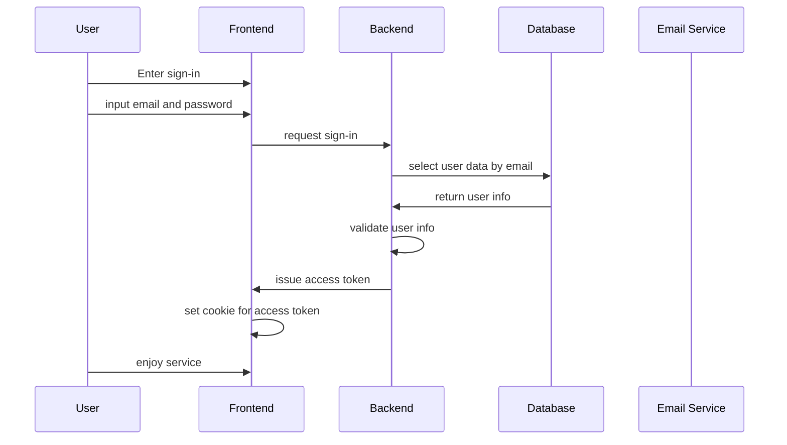

### 1회성 토큰 발급 및 사용

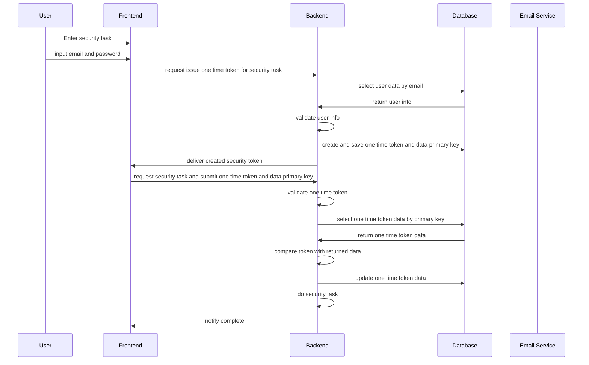

### 1회성 토큰 발급 및 사용 (이메일)

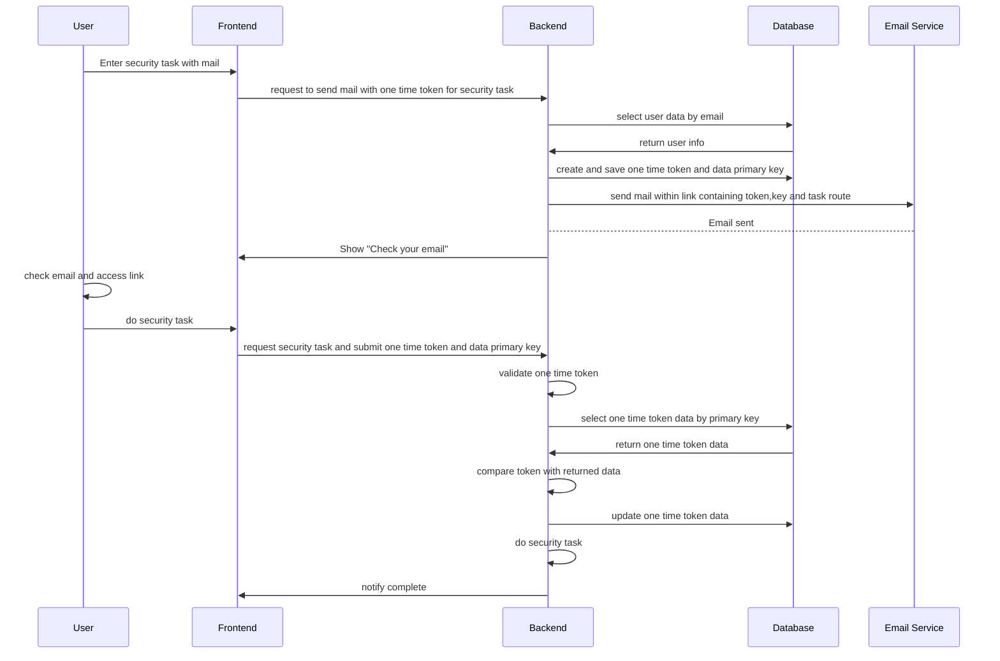

### 이메일 인증

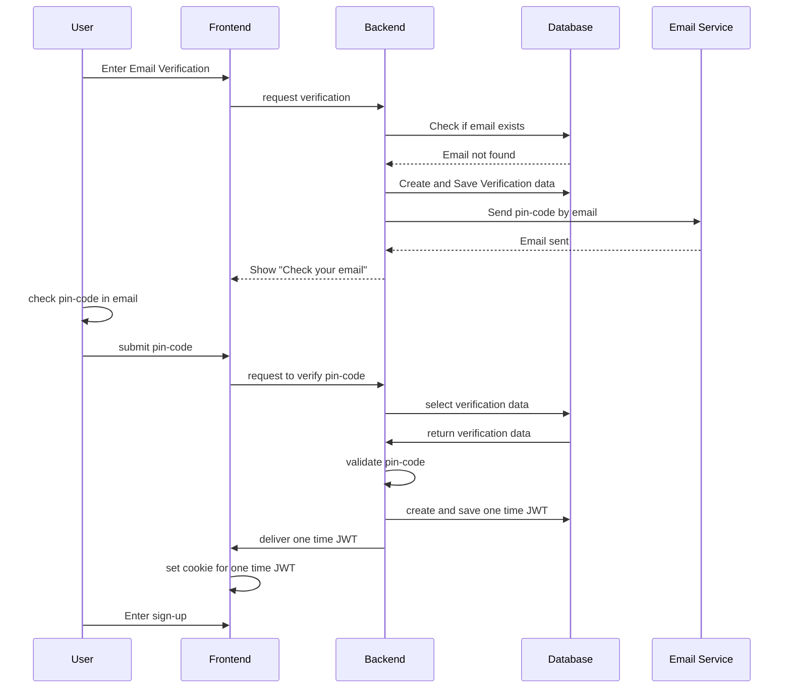

### 회원가입

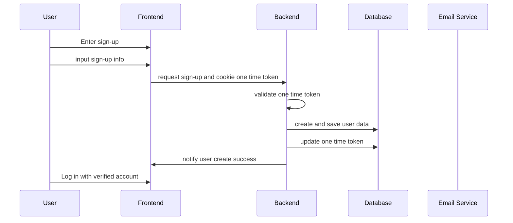

## 사용자 정보 및 Auth 로직 구현

- 백엔드 서버는 MVC 패턴과 Layer 구조으로 구현되어 있습니다.
- 새롭게 추가될 인증 로직과 사용자 정보 관련 로직도 동일한 아키텍처로 진행하였습니다.
- 단, 인증 로직은 기본적인 Module, Controller, Service에 더하여 Guard를 사용하여 구현하였습니다.

  - 사용자 정보 관련 로직은 Module, Controller, Service를 사용하여 구현하였습니다.

### User 데이터 관련 로직

- `@dataui/crud` 패키지를 사용하여 GET HTTP API를 손쉽게 구현하였습니다.
  - 해당 패키지는 CRUD 서비스를 손쉽게 구현하도록 도와줍니다.

1. UserService

- 사용자 정보를 저장하는 User 테이블과 관련된 기능을 제공합니다.
  - 예시 : 사용자 검색, 생성, 갱신 , 삭제
- 다른 Module에서 재사용할 수 있습니다.

2. UserController

- 사용자 정보와 관련된 HTTP API를 제공합니다.
- 여러가지 Service를 활용하여 동작을 합니다.
- 각 API는 적합한 Guard로직이 이식되어 인증 또는 권한을 판단합니다.

3. UserModule

- Service와 Controller에 대한 의존성 주입을 담당합니다.
- 해당 모듈을 import하여 UserService 로직을 다른 모듈에서 재사용할 수 있습니다.

### Guard 사용

- Guard를 사용하는 이유는 3가지 입니다.

  1. 서버 부하 저하

  - nest.js 파이프라인에서 Guard는 실행순서가 빠르므로, 비정상 요청을 빠르게 차단하여 불필요한 작업을 줄입니다.

  2. 로직 확장성

  - Guard는 사용자 요청에 접근이 가능하므로, Guard 이후의 파이프라인 또는 핸들러에 변형된 Request를 전달할수 있습니다.
  - metaData를 사용하여 Guard 로직에 다양한 옵션을 전달할 수 있습니다.

  3. 라우터 기반 동작 지원

  - Guard는 라우터 기반으로 적용할 수 있습니다.
  - 라우터 핸들러 로직 수정 없이, 데코레이터를 사용하여 로직을 적용할 수 있습니다.

- Guard는 크게 2가지로 구분하였습니다.

  1. Authentication Guard

  - API 요청자가 인증된 사용자 인지 아닌지 검증 합니다.
  - 예시 : 이메일& 비번 인증, JWT 인증 그, 1회성 토큰 인증

  2. Authorization Guard

  - API 요청자가 권한이 있는지 없는지 확인합니다.
  - 예시 : 리소스 편진 권한 검증, 관리자 권한 검증

- 일반적인 동작은 다음과 같습니다.

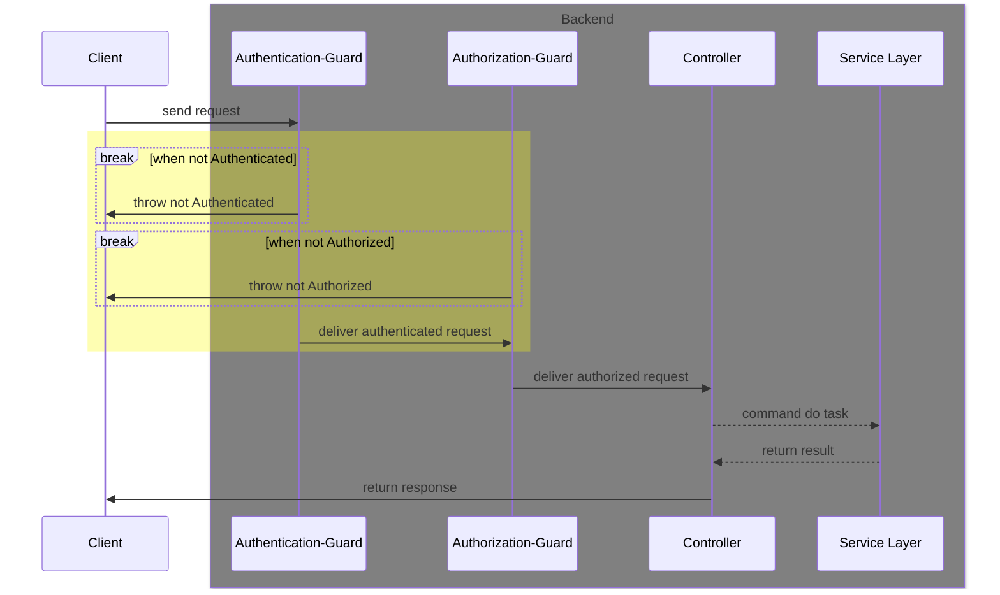

- 자세한 코드는 다음 링크에서 참조하실 수 있습니다.
  - [깃허브 ggrim-back-main](https://github.com/SeongTeam/ggrim-back-main)

### 해쉬 함수

- bcrypt와 sha-256 알고리즘을 함께 사용하여 구현하였습니다.
- bcrypt를 사용한 이유는 2가지 입니다.

  1. 보안성

  - bcrypt는 기본적인 해쉬함수 보다 더 많은 공격들을 방어해줍니다.

  2. 구현 난이도

  - nest.js 공식 문서을 포함하여 많은 bcrypt 예제가 있습니다.

- bcrypt 사용시 2가지 문제가 있습니다.

  1. bcrypt 암호화 알고리즘은 서버 부하가 증가시킵니다.
  2. 길이가 긴 문자열에 대해 보안이 취약합니다.

  - 서버 부하 증가 문제는 비동기 동작을 통해 완화하였습니다.
    - cpu 비용이 높은 연산에 대해서 bcrypt는 비동기 API를 지원합니다.
  - 길이가 긴 문자열에 대한 보안 취약성은 sha-256를 함께 사용하여 해결하였습니다.
    - sha-256은 해싱의 결과가 항상 32바이트 문자열을 보장하며, 입력 문자열의 크기는 넉넉하게 1GB까지도 가능합니다.
    - 입력된 문자열에 sha-256을 사용하여 32바이트 문자열로 해싱 한 뒤, bcrypt를 사용하는 방법을 선택하였습니다.

### Guard payload 정의

- Guard가 수행한 결과를 Request 객체에 저장하였습니다.

```js
@Injectable()
export class TokenAuthGuard implements CanActivate {
  constructor(
    @Inject(AuthService) private readonly authService: AuthService,
    @Inject(forwardRef(() => UserService)) private readonly userService: UserService,
  ) {}

  async canActivate(context: ExecutionContext): Promise<boolean> {
    const req = context.switchToHttp().getRequest();

    const authHeader = req.headers[ENUM_HEADER_FIELD.AUTHORIZATION];

    if (!authHeader || !authHeader.startsWith('Bearer ')) {
      throw new UnauthorizedException('Missing or invalid Authorization Bearer header');
    }

    const token = this.authService.extractAuthorizationField(authHeader, 'Bearer');

    const decoded: JWTDecode = await this.authService.verifyToken(token);
    const email = decoded.email;

    const user = await this.userService.findOne({ where: { email } });
    if (!user || user.active != 'active') {
      throw new UnauthorizedException(`${email} user is deleted or not active`);
    }


    const result: AccessTokenPayload = {
      userId: user.id,
      decodedToken: decoded,
    };
    req[ENUM_AUTH_CONTEXT_KEY.ACCESS_TOKEN] = result;

    const userResult: AuthUserPayload = {
      user,
    };
    req[ENUM_AUTH_CONTEXT_KEY.USER] = userResult; //*

    return true;
  }
}

```

- 인증 Guard는 모두 DB에 접근하여 User를 탐색합니다.
- 해당 정보를 Request에 저장하여 Controller에 전달한다면, 다음 3가지를 목적을 달성 할 수 있다고 판단하였습니다.
  1. 로직 중복 감소
  - Guard 로직에서 수행한 동작을 Controller-Service 레이어에서 동작할 필요가 없습니다.
  2. 쿼리 감소
  - DB에 접근하여 User 정보를 다시 탐색할 필요가 없습니다.
  3. 코드 가독성 향상
  - `@UseGuard()` 데코레이터만 추가하면 User 정보를 확인할 수 있으므로, Controller 메소드 코드 길이 감소

### Guard Metadata 정의

- Guard 클래스의 동작을 설정하기 위해서 Metadata를 정의하였습니다.
  - Guard를 Method 레벨에서만 사용하는 상황이고, 메소드마다 Guard 설정을 다르게 해야하는 상황이 있었기 때문입니다.
- 이번에는 코드와 함께 예시를 설명드리겠습니다.

```js
  @Put(':email/username')
  @UseInterceptors(QueryRunnerInterceptor)
  @CheckOwner({  //*
    serviceClass: UserService,
    idParam: 'email',
    serviceMethod: 'findUserByEmail',
    ownerField: 'id',
  })
  @UseGuards(TokenAuthGuard, OwnerGuard)  //**
  async replaceUsername(
    @DBQueryRunner() qr: QueryRunner,
    @Request() request: any,
    @Param('email') email: string,
    @Body() dto: ReplaceUsernameDTO,
  ) {
     //...
  }
```

- API를 제공하는 `replaceUsername()` 메소드는 `CheckOwner` 메타데이터를 사용하여 `OwnerGuard` 동작을 설정해줍니다.
- `OwnerGuard`는 API를 통해 접근하려는 리소스의 소유자인지 아닌지를 판단하여 권한을 검증합니다.
- API마다 접근하려는 리소스가 다르므로, `OwnerGuard`는 매번 상황에 적절한 서비스 로직을 사용하여 리소스의 소유자 여부를 확인해야합니다.
- `CheckOwner`는 이러한 정보를 담을 수 있는 역할을 하여 `OwnerGuard`의 동작에 정보를 제공합니다.

```js
@Injectable()
export class OwnerGuard implements CanActivate {
  constructor(
    private readonly reflector: Reflector,
    private readonly moduleRef: ModuleRef,
  ) {}
  async canActivate(context: ExecutionContext): Promise<boolean> {
    const options = this.reflector.get<CheckOwnerOption>(CHECK_OWNER_KEY, context.getHandler());  //*

    // ...
    const request = context.switchToHttp().getRequest();
    const userPayload: AuthUserPayload = request[ENUM_AUTH_CONTEXT_KEY.USER];
    const { user } = userPayload;
    //...

    const { serviceClass, idParam, ownerField, serviceMethod } = options;  //**

    const resourceId = request.params[idParam];

    const serviceInstance = this.moduleRef.get(serviceClass, { strict: false });

    //...

    if (resource[ownerField] !== user.id) {
      throw new ServiceException(
        `ENTITY_NOT_FOUND`,
        `FORBIDDEN`,
        `can't access resource without ownership`,
      );
    }

    return true;
  }
}
```

- `OwnerGuard` 내부에서는 메타데이터를 통해서 얻은 정보로 동작을 하면 되므로, 메타데이터에만 의존하며 동작합니다.
- 이러한 동작 독립성이 재사용성과 단일 책임을 높인다고 판단하여 메타데이터를 사용하였습니다.

- 메타데이터는 정보 제공용도뿐만 아니라, Guard 동작 옵션을 설정할 때도 사용하였습니다.

```js
  @Delete(':email')
  @CheckOwner({
    serviceClass: UserService,
    idParam: 'email',
    serviceMethod: 'findUserByEmail',
    ownerField: 'id',
  })
  @PurposeOneTimeToken('delete-account')
  @UseGuards(SecurityTokenGuard, OwnerGuard) //*
  @UseInterceptors(QueryRunnerInterceptor)
  async deleteUser(
    @DBQueryRunner() qr: QueryRunner,
    @Request() request: any,
    @Param('email') email: string,
  ) {
    //...
  }
```

- `deleteUser` 메소드는 계정을 삭제하는 API를 제공합니다.
- `SecurityTokenGuard`을 사용하여 토큰을 통해 요청자를 확인합니다.
  - 이때는 사용자가 DB에서 실제 활성화된 유저인지 탐색합니다.
  - `SecurityTokenGuard`와 같은 인증 Guard는 모두 DB에 접근하여 사용자가 실제 활성화된 유저인지 확인합니다.
- 인증 Guard의 사용자 탐색은 모든 상황에서 적절치 않은 문제가 있습니다.
  1. 사용자가 삭제된 후, 계정 복구를 위해 1회성 토큰을 발급받은 경우
  - 사용자가 삭제 상태이므로 활성화된 유저 탐색에서는 찾을 수 없습니다.
  2. 사용자가 비활성화 된 후, 계정 복구를 위해 1회성 토큰을 발급받은 경우
  - 사용자가 비활성화 상태이므로, 활성화된 유저 탐색에서는 찾을 수 없습니다.
- 이러한 문제를 해결하기 위해서는 인증 Guard에게 사용자 탐색 옵션을 설정할 필요가 있다고 판단하였습니다.

```js

  @Patch('recover/:email')
  @CheckOwner({
    serviceClass: UserService,
    idParam: 'email',
    serviceMethod: 'findDeletedUserByEmail',
    ownerField: 'id',
  })
  @PurposeOneTimeToken('recover-account')
  @SecurityTokenGuardOptions({ withDeleted: true }) // *
  @UseGuards(SecurityTokenGuard, OwnerGuard)
  @UseInterceptors(QueryRunnerInterceptor)
  async recoverUser(
    @DBQueryRunner() qr: QueryRunner,
    @Request() request: any,
    @Param('email') email: string,
  ) {
    //...
  }
```

- `recoverUser` 메소드는 삭제된 사용자를 복구하는 API를 제공합니다.
- `deleteUser`와 동일하게 `SecurityTokenGuard`을 사용하여 토큰을 통해 요청자를 확인합니다.
- 이때, 요청자는 삭제된 상태이므로 일반적인 탐색으로는 찾을 수 없으므로, `SecurityTokenGuardOptions`을 사용하여 옵션을 제공하였습니다.
- 옵션이 없다면 기본적인 동작을 진행하고, 옵션이 있다면, 옵션에 알맞는 동작을 하다도록 설정하였습니다.

```js
@Injectable()
export class SecurityTokenGuard implements CanActivate {
  constructor(
    @Inject(AuthService) private readonly authService: AuthService,
    @Inject(forwardRef(() => UserService)) private readonly userService: UserService,
    private readonly reflector: Reflector, //
  ) {}

  async canActivate(context: ExecutionContext): Promise<boolean> {
    const req = context.switchToHttp().getRequest();
    //...
    //...
    const rawOptions: SecurityTokenGuardOptions | undefined =
      this.reflector.get<SecurityTokenGuardOptions>(
        SECURITY_TOKEN_GUARD_OPTIONS,
        context.getHandler(),
      );
    const options = this.normalizeOptions(rawOptions);
    const { withDeleted } = options;
    //...
  }

  normalizeOptions(options?: SecurityTokenGuardOptions): SecurityTokenGuardOptions {
    const defaultOptions: SecurityTokenGuardOptions = { withDeleted: false };
    if (options === undefined || options === null) {
      return defaultOptions;
    }

    const keys = Object.keys(defaultOptions) as (keyof SecurityTokenGuardOptions)[];

    keys.forEach((key) => {
      if (isEmpty(options[key])) {
        options[key] = defaultOptions[key];
      }
    });

    return options;
  }
}
```

- `normalizeOptions`를 사용하여 기본적인 옵션과 메타데이터에서 읽은 옵션을 병합하였습니다.
- 병합된 옵션은 `canActivate`에서 사용됩니다.
- 이러한 동작 구조가 옵션의 필드가 추가되어도, 유지 보수에 용이할거라 판단하였습니다.

### 메일 로직

- `@nestjs-modules/mailer` 패키지를 사용하여 구현하였습니다.
  - `@nestjs-modules/mailer`패키지는 `nodemailer` 패키지에서 제공하는 기능을 nestjs Module 형식으로 제공합니다.
- 메일 로직이 API 접근에 대한 인증 및 인가에는 직접적으로 사용되진 않지만, 이메일 인증에 사용됩니다.
- 메일 로직은 Module과 Service 만으로 구현하였습니다.
  - `@nestjs-modules/mailer` 패키지가 직접적으로 module을 제공하긴 하지만, 서비스 계층을 커스터마이징 하기위해서 커스텀 Module을 정의하였습니다.

```js
import { MailerModule } from '@nestjs-modules/mailer'

@Module({
  imports: [
    //need to async because env is loaded asynchronously by configModule
    MailerModule.forRootAsync({
      useFactory: () => ({
        transport: {
          // host and port is not needed when you config service option
          // host: process.env[ENV_MAIL_HOST] || 'abc.com',
          // port: Number(process.env[ENV_SMTP_PORT] || '1234567'),
          service: process.env[ENV_MAIL_SERVICE] || ENV_MAIL_SERVICE,
          auth: { user: process.env[ENV_SMTP_ID], pass: process.env[ENV_SMTP_PW] },
          secure: true,
        },
        defaults: { from: process.env[ENV_SMTP_FROM_EMAIL] },
        template: {
          dir: process.cwd() + '/src/mail/templates/',
          adapter: new HandlebarsAdapter(),
          options: { strict: true },
        },
      }),
    }),
  ],
  providers: [MailService],
  exports: [MailService],
})
export class MailModule {}
```

- `secure : true` 옵션을 설정하여 메일서버와 연결시 TLS를 사용합니다.
  - 메일로 전송될 정보에는 핀코드, 1회성 토큰을 포함한 링크 등이 전달되기 때문에 보안을 위해서 TLS를 사용하였습니다.
  - 물론, `secure : false` 옵션을 사용해도 `STARTTLS` 명령어를 사용하면 명시적으로 TLS를 사용할 수 있습니다.
- `template` 옵션을 사용하여 이메일 템플릿을 사용하였습니다.

# 결론

## 제약 사항 만족여부

1. 서버 부하

- 부하가 증가하지만, 완화할 수 있습니다.
  1. jwt 페이로드 길이와 검증 알고리즘을 조율하여 jwt로 인한 부하를 완화할 수 있습니다.
  2. Guard 파이프라인을 사용하여, 사전에 비인가 요청을 차단하여 부하를 완화할 수 있습니다.
  3. bcrypt Async API를 사용하여, 비용 높은 연산에 의한 부하를 완화합니다.

2. 보안성

- 중요 정보는 bcrypt를 통해 암호화되므로, 탈취 및 도난 위험이 완화됩니다.
- jwt 토큰 서명 검증을 통해 위조를 위험을 완화합니다.
  - jwt 탈취 및 도난 위험은 인프라 및 프론트앤드에서 관리가 필요합니다.

3. 인증 및 권한 로직 확장

- jwt 페이로드에 다양한 정보를 담을 수 있으므로 다양한 용도의 토큰을 생성할 수 있습니다.
- Guard 파이프라인은 API 요청에 접근가능하므로, 다양한 정보를 후속 작업에 전달할 수 있습니다.
- Guard 파이프라인은 Metadata와 조합하여 동작 옵션을 활용할 수 있습니다.

4. 라우트 기반 적용

- 라우터 핸들러 로직 수정 없이, 데코레이터를 사용하여 Guard 파이프라인 로직을 적용할 수 있습니다.

5. 구현 난이도

- `nest.js` 에서 jwt API를 제공합니다.
- bcrypt 예제는 매우 많으므로, 로직을 쉽게 구현할 수 있습니다.

## 해결해야할 문제

- 제가 생각하기에 최우선으로 보완이 필요한 부분을 정리하였습니다.
- 회고록을 작성하며 부족했던 부분에 대한 해결책을 떠올릴 수 있었습니다.

### 1회성 JWT 마킹 자동화 필요

- 현재 백엔드는 DB 리소스 생성,갱신,삭제 쿼리시, transaction을 사용할 수 있도록 Interceptor를 사용하고 있습니다.
- Interceptor은 `TypeORM`의 `QueryRunner` 인스턴스를 사용하여 Controller layer에서 실행되는 쿼리를 Transaction단위로 처리합니다.
- 현재 로직의 문제점은 Guard가 Interceptor보다 먼저 실행되기 때문에, Guard는 `QueryRunner` 인스턴스에 접근할 수 없다는 것입니다.
- 일반적인 동작은 다음과 같습니다.

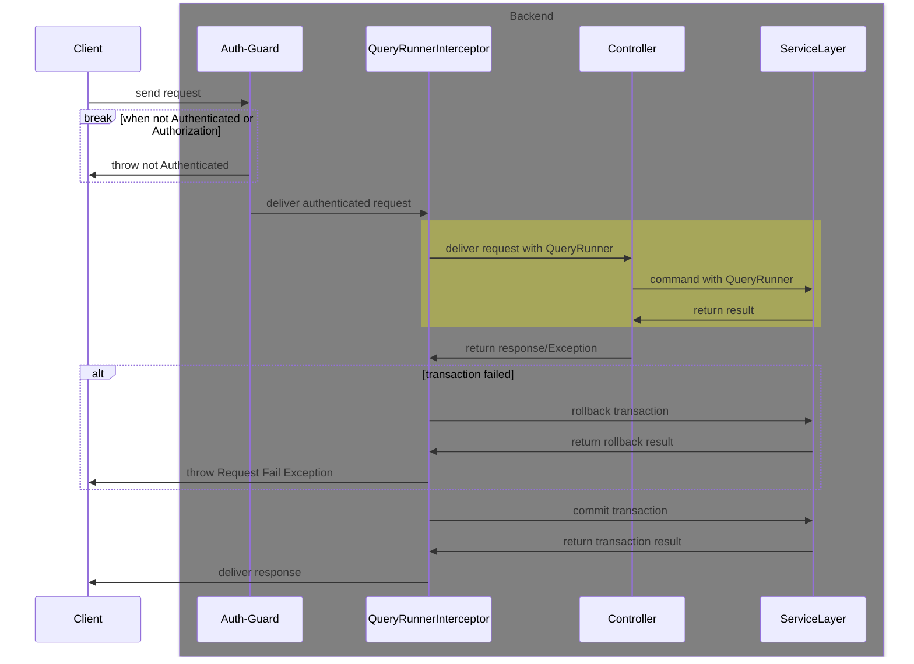

- 1회성 JWT 정보는 DB에 저장되기 때문에, 사용된 경우에는 Update 쿼리를 통해서 정보를 갱신해야합니다.
- `QueryRunner`를 사용해서 정보를 갱신해야하는 이유는 1가지입니다.

1. 원자성 보장

- 1회성 토큰을 사용하여 DB 리소스 생성,갱신,삭제 쿼리가 실패한 경우, 1회성 토큰 갱신도 함께 실패해야합니다.
- 원자성이 보장되지 않는다면, 사용자 입장에서는 동작이 실패했음에도 1회성 토큰을 소모하는 모순적인 상황이 발생합니다.

- 다음 코드는 현재는 어떤 방식으로 1회성 토큰 마킹을 처리하는지 나타냅니다.

```js
  @Patch('recover/:email')
  @CheckOwner({
    serviceClass: UserService,
    idParam: 'email',
    serviceMethod: 'findDeletedUserByEmail',
    ownerField: 'id',
  })
  @PurposeOneTimeToken('recover-account')
  @SecurityTokenGuardOptions({ withDeleted: true })
  @UseGuards(SecurityTokenGuard, OwnerGuard)
  @UseInterceptors(QueryRunnerInterceptor)
  async recoverUser(
    @DBQueryRunner() qr: QueryRunner,
    @Request() request: any,
    @Param('email') email: string,
  ) {
    //...

    //Marking One Time JWT as Used
    const securityToken: SecurityTokenPayload = request[ENUM_AUTH_CONTEXT_KEY.SECURITY_TOKEN];
    await this.authService.markOneTimeJWT(qr, securityToken.oneTimeTokenID);
  }
```

- Controller 메소드 내에서 명시적으로 1회성 토큰을 마킹합니다.
- `SecurityTokenGuard`에서 1회성 토큰 검증 결과가 payload에 저장되어있습니다.
- payload에 저장된 정보를 사용하여 1회성 토큰을 사용함으로 마킹합니다. 이때 `QueryRunner`를 사용하여 transaction을 사용합니다.

- 현재 고려중인 해결방안은 **QueryRunner 생성 로직과 QueryRunner 커밋/롤백 로직을 분리하는 것**입니다.
- 현재 로직은 `QueryRunnerInterceptor`에서 QueryRunner 생성 로직과 커밋/롤백 로직을 함께 갖고 있습니다.
- 추후, Guard 로직에서 QueryRunner가 필요한 상황이 많아질 수 있으므로, Guard보다 앞서서 실행되는 Middleware를 사용을 고려중입니다.

1. 방안 1: Middleware 와 Interceptor 사용

- 가장 먼저 실행되는 Middleware에서 QueryRunner를 실행하면, 이후에 실행되는 Guard 등의 모든 파이프라인은 transaction을 사용할 수 있습니다.
- Interceptor는 Controller의 결과를 기반으로 transaction 커밋/롤백을 결정하면 됩니다.
- 해당 로직은 로직만 옮기면 되므로, 수정하기 쉬울 것으로 예상됩니다.
- 또한 수정해야할 영역이 매우 적으므로, 사이드이펙트 위험성이 적습니다.
- 다만, 매번 method-level에 `@UseMiddleware`와 `@UseInterceptor` 2개를 명시해야합니다.
  - 해당 부분은 global-level에 Middleware와 Interceptor를 적용하면 해결될 부분입니다.

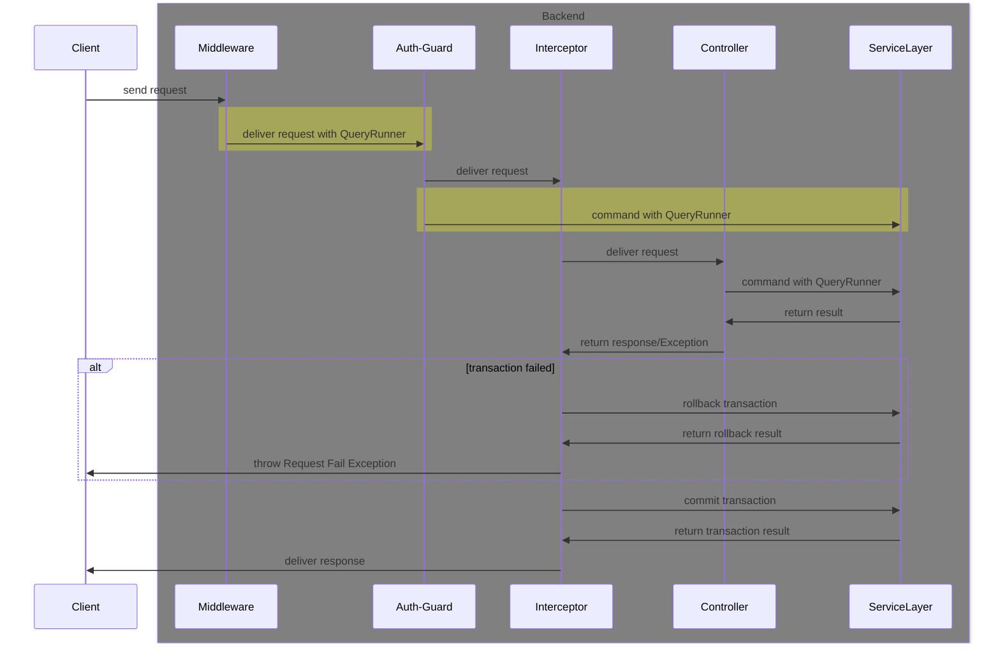

2. 방안2 : Middleware와 ExceptionFilter 사용

- 가장 먼저 실행되는 Middleware에서 `QueryRunner`를 생성하고 response 반환시 실행될 이벤트 리스너를 등록합니다.
  - 해당 이벤트 리스너가 실행되면 transaction 커밋을 진행합니다.
- 이후 익셉션이 발생하면, ExceptionFilter에서 `QueryRunner`를 사용하여 transaction 롤백을 진행합니다.
- 해당 로직은 방안1보다 좀더 수정해야할 부분이 많습니다.
- 따라서, 비용이 증가하고, 사이드 이펙트 영향이 상대적으로 큽니다.

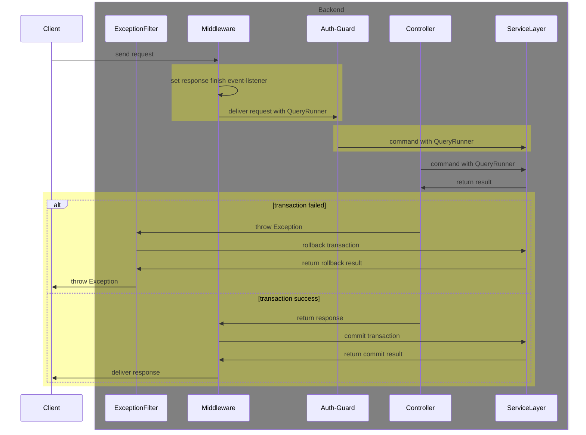

- 두 가지 방안 중 상황에 맞는 방안을 선택할 것 같습니다.
- 이외에도 여러 방안이 더 있지만 제가 생각하기에 2가지 방안이 가장 확장성과 유지보수성이 높다고 판단하였습니다.

### 그 외

- 로직을 좀더 개선하기 위한 방안은 다음과 같습니다.
  1. Oauth 도입하기
  - 회원가입 편의성 및 보안성 강화할 수 있다고 생각합니다.
  2. Custom Auth Exception 로직 추가하기
  - 다양한 Auth Exception은 사용자에게 좀더 세밀한 정보를 전달할 수 있을 거라 생각합니다.
  - 당장 필요한 부분은 아니므로, 추후 상황을 고려하여 구현할 예정입니다.
  3. 테스트 로직 구현하기
  - Auth 로직 수정에 따른, 사이드 이펙트를 확인하기 위해서 필요하다고 생각됩니다.
  - Guard를 사용하는 API에 대한 테스트를 위해서 로그인 같은 추가적인 설정이 필요하다고 생각됩니다.

## 고찰

- 제약 사항을 늦게 파악할 수록, 설계 및 구현 비용이 증가한다.
- 설계의 완벽성은 검토 횟수와 고민에 비례한다.

  - 설계는 시간이 부족할때 까지, 반복적으로 결점을 보완하고, 추상화하여 진행해야한다. 이때 보완과 추상화에는 많은 고민이 뒷따른다.

- 로직이 분명할수록, 코드가 가독성이 높을수록 디버깅 효율이 증가한다.

### `passport`와 비교

- `passport`는 인증 로직 구현 패키지로, 다양한 인증 Strategy를 간단하게 구현할 수 있습니다.
- `nestjs/passport` 패키지는 `passport`를 nestjs의 모듈 형식으로 제공합니다.
- 편리한 패키지이지만, 이번에 사용하지 않고 직접 구현한 이유는 2가지 입니다.

1. 학습 경험

   - 인증 도메인 지식 학습
   - 아키텍처, 코딩 패턴, 타입스크립트 문법 학습
     - 가장 큰 목적이었습니다.
     - 어떻게 하면 좋은 코드를 짤 수 있을지 고민해볼 수 있었습니다.
     - 인증에서 어떤 점이 중요한지 등을 점검해볼 수 있었습니다.

2. 학습 시간 부족

   - `passport`와 `nestjs/passport` 패키지를 학습 우선도가 낮았기 때문에 많은 시간을 투자할 수 없었습니다.
   - 해당 패키지가 추상화가 높아서 흐름을 한번에 이해하기 어려웠습니다.
     - `Strategy`와 `passport` 그리고 `AuthModule(Strategy)`의 관계를 이해할 시간이 부족했습니다.
   - 제 성향상, 이해도가 부족한 모듈과 패키지 사용을 꺼려합니다.
     - 예기치 못한 버그가 발생시, 해결할 능력이 부족할 수 있기 때문입니다.

- 이 글을 작성하면서, `nestjs/passport`에 대해 알아보았는데요.
- 패키지를 사용했다면, 좀더 빠르게 안정적인 로직을 구현할 수 있었을 거라 생각이 되었습니다.
- 추후, Oauth2 인증 로직을 추가한다면, `passport`를 사용할 예정입니다.
- 메모용도로, 제가 파악한 `passport` 동작을 정리하겠습니다.

**의존성**

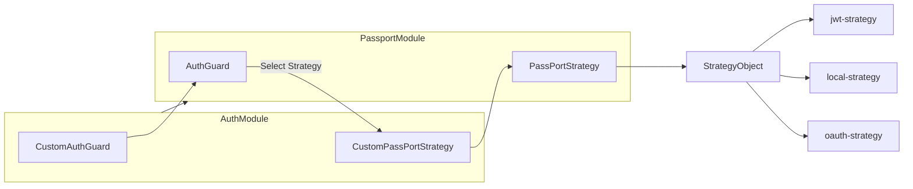

**동작**

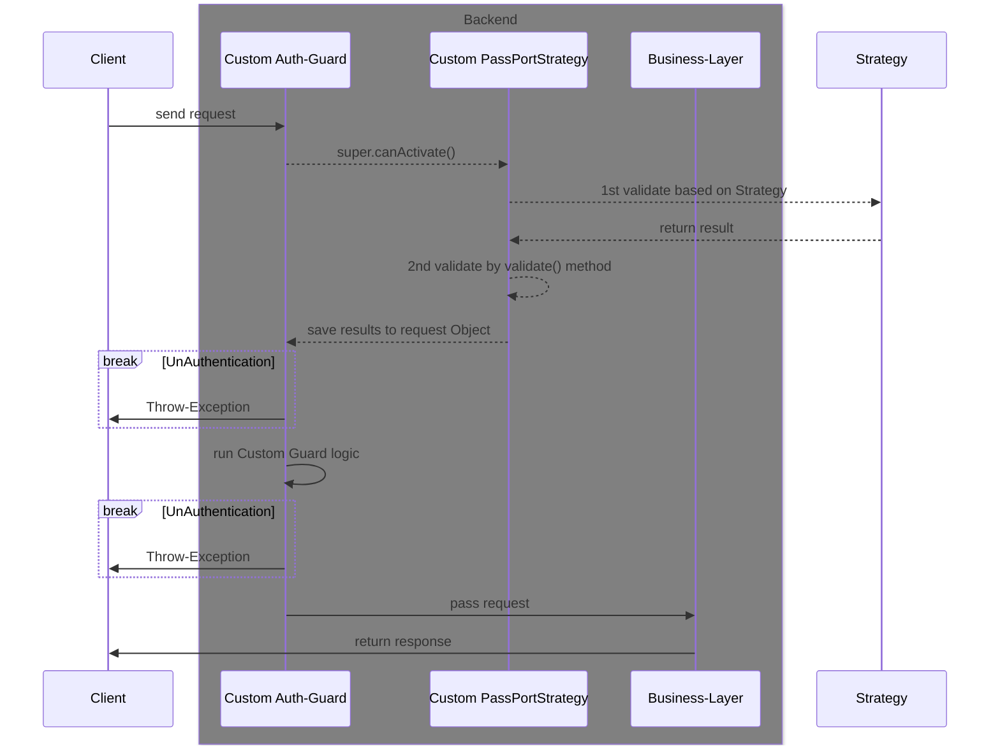

- 참고
  - [passport 공식 문서](https://www.passportjs.org/)
  - [nestjs 공식문서](https://docs.nestjs.com/recipes/passport#implementing-passport-local)
